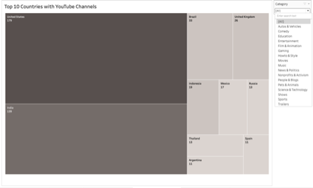

# Tableau Visuals

Here are some interactive Tableau visualizations that I've created. Click on each image or link to view the interactive dashboard.

## Visual 1: Sales Performance Dashboard

## Visual 2: Customer Segmentation Analysis
[

## Visual 3: Market Trends Visualization

## Visual 3: Market Trends Visualization

## Visual 3: Market Trends Visualization

