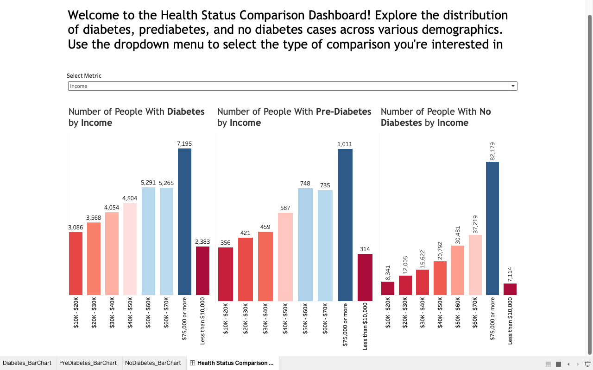

**Project Overview**
Task: This project uses the Diabetes Health Indicators (BRFSS 2015) dataset, which contains over 253,000 survey responses about diabetes, medical conditions, and lifestyle factors. The goal is to create an interactive Tableau dashboard that compares people with diabetes, prediabetes, and no diabetes across various health indicators.

**Key Dataset Variables:**
- Diabetes_012: Diabetes status (No Diabetes, Prediabetes, Diabetes).
- HighBP: Indicates whether the individual has high blood pressure.
- HighChol: Indicates whether the individual has high cholesterol.
- CholCheck: Whether the individual has had a cholesterol check in the past 5 years.
- BMI: Body Mass Index, a measure of body fat based on height and weight.
- Smoker: Whether the individual has smoked at least 100 cigarettes in their lifetime
- Stroke: Whether the individual has ever been told they had a stroke.
- HeartDiseaseorAttack: Whether the individual has a history of coronary heart disease or a heart attack
- PhysActivity: Whether the individual engaged in physical activity in the past 30 days (excluding job-related activity).
- Fruits: Whether the individual consumes fruits at least once per day.
- Veggies: Whether the individual consumes vegetables at least once per day.
- HvyAlcoholConsump: Whether the individual engages in heavy alcohol consumption.
- AnyHealthcare: Whether the individual has any type of healthcare coverage
- NoDocbcCost: Whether the individual was unable to see a doctor due to cost in the past 12 months.
- GenHlth: Self-reported general health
- MentHlth: Number of days in the past 30 days the individual’s mental health was not good
- PhysHlth: Number of days in the past 30 days the individual’s physical health was not good.
- DiffWalk: Whether the individual has serious difficulty walking or climbing stairs.
- Demographics: Includes columns like Sex, Age, Education, and Income, which help analyze trends based on various demographic factors.

**Key Features:**
- Interactive Visualizations: Explore health metrics across diabetes status groups.
- Comparative Analysis: Compare lifestyle, medical conditions, and health outcomes by diabetes status.
- User-Friendly: Easy to navigate and filter by demographics for deeper insights.

**Technologies Used:**
- Tableau for interactive dashboards.
- Kaggle Dataset: Diabetes Health Indicators (BRFSS 2015).

**Dashboard:**

  

Access to Tableau file and Dataset
[Folder](https://drive.google.com/drive/folders/1rJLi932eD2gBksJCQdaBhFvT2ezpf92D)  

