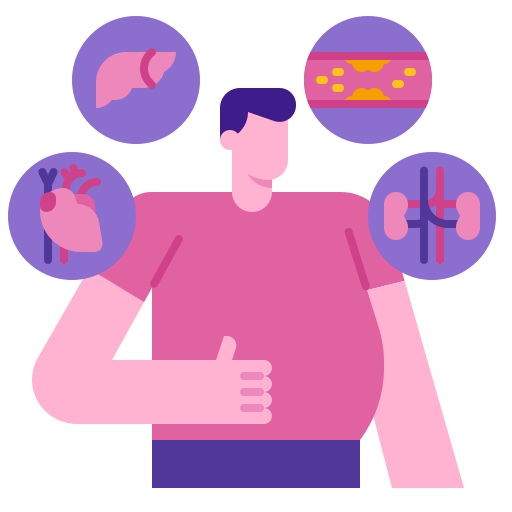

<h1>Data Visualisation Projects</h1>

Explore the data visualization projects I have developed:

<table>
  <tr>
    <td align="center" onclick="showProject('youtubersAnalysis')">
       
      <b>Youtubers Analysis</b>
    </td>
    <td align="center" onclick="showProject('diabetesDashboard')">
       
      <b>Diabetes Health Dashboard</b>
    </td>
    <td align="center" onclick="showProject('eCommerceAnalysis')">
       
      <b>E-Commerce Analysis</b>
    </td>
  </tr>
</table>

<!-- Container for displaying project content -->

  <h2>Click on a project to see details here</h2>

<!-- JavaScript for dynamic content -->

