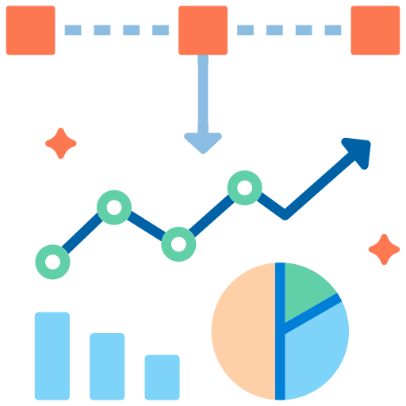
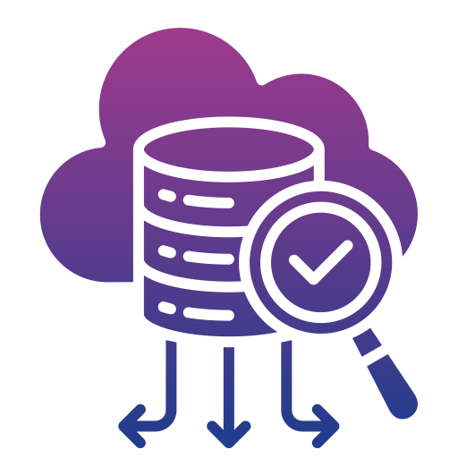

# Welcome to My Portfolio

## Table of Contents
1. [About Me](#about-me)
2. [Projects](#projects)
3. [Skills](#skills)
4. [Education](#education)
5. [Let's Connect](#lets-connect)

---

## About Me

🎯 **Data Analyst & Scientist** | AI Enthusiast | Business Strategist

- **Global Experience:** Worked in retail, consulting, and startups across the US, Saudi Arabia, and Ireland.
- **Expertise:** Data analysis, business intelligence, predictive modeling, and actionable insights.
- **Skills:** Building dashboards, uncovering trends, and optimizing processes.
- **Mission:** Turning raw data into strategic assets for growth and efficiency.

---

## Projects

Below are some of my key projects. Click on each project to learn more.

<table>
  <tr>
    <td align="center">
      <a href="./Machine_Learning/index.html">
         
        <b>Machine Learning - AI Models</b>
      </a>
      
Built AI image and text classification models.

    </td>
    <td align="center">
      <a href="./Data_Visualisation/index.html">
         
        <b>Data Visualization - Tableau</b>
      </a>
      
Created interactive dashboards showcasing business insights.

    </td>
    <td align="center">
      <a href="./Data_Storage/index.html">
         
        <b>Data Storage Solution for Analytics</b>
      </a>
      
Designed scalable storage systems to optimize data processing.

    </td>
  </tr>
</table>

---

## Skills

### Technical Skills

- **Programming:** Python, SQL, R  
- **Visualization Tools:** Tableau, Power BI  
- **Machine Learning Frameworks:** Scikit-learn, TensorFlow  
- **Platforms:** Google Colab, Visual Studio Code, Flask, GitHub, SSMS

### Soft Skills

- Communication, Problem Solving, Time Management  
- Team Collaboration, Learning Agility, Presentation Skills

---

## Education

### Dublin Business School
*MSc in Data Analytics*  
**Key Coursework:** Machine Learning, Big Data Analysis

### University of San Francisco
*MBA – Focus: Business Strategy and Analytics*

### San Diego State University
*BSc in Computer Engineering*

---

## Let's Connect

- 📧 **Email:** [baqeralshakhs@gmail.com](mailto:baqeralshakhs@gmail.com)  
- 💼 **LinkedIn:** [linkedin.com/in/baqeralshakhs](https://www.linkedin.com/in/baqeralshakhs)  

---
